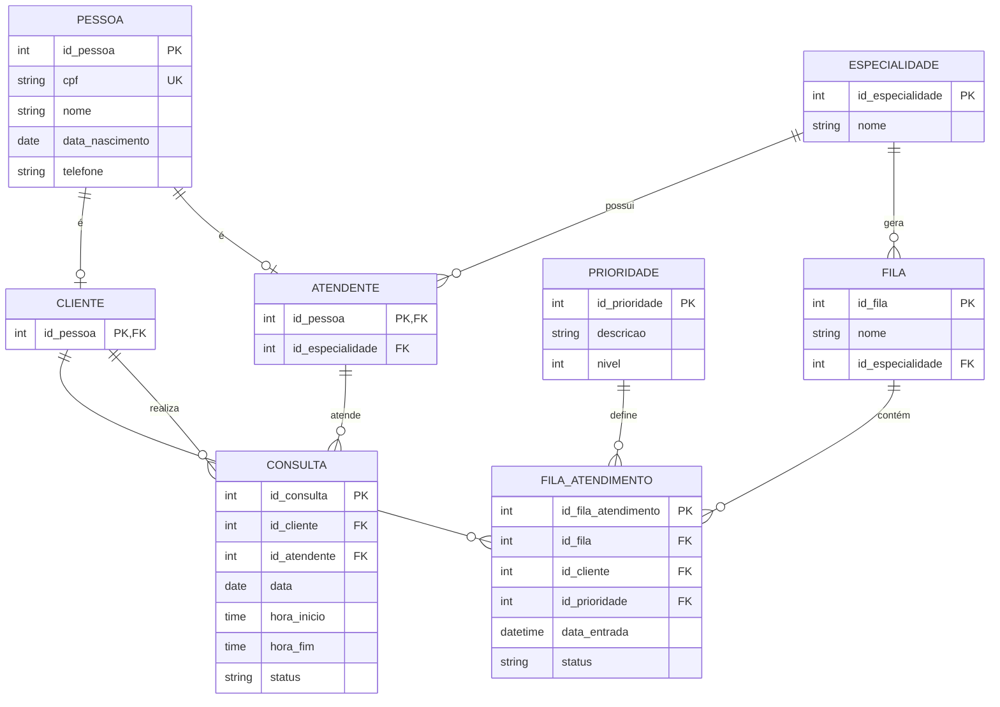

# fila_atendimento
Aplicativo para empresa de registro de atendimento (controle de filas, registro de atendentes e pessoas atendidas)

```mermaid
erDiagram

    PESSOA {
        int id_pessoa PK
        string cpf UK
        string nome
        date data_nascimento
        string telefone
    }

    CLIENTE {
        int id_pessoa PK,FK
    }

    ATENDENTE {
        int id_pessoa PK,FK
        int id_especialidade FK
    }

    ESPECIALIDADE {
        int id_especialidade PK
        string nome
    }

    PRIORIDADE {
        int id_prioridade PK
        string descricao
        int nivel
    }

    FILA {
        int id_fila PK
        string nome
        int id_especialidade FK
    }

    FILA_ATENDIMENTO {
        int id_fila_atendimento PK
        int id_fila FK
        int id_cliente FK
        int id_prioridade FK
        datetime data_entrada
        string status
    }

    CONSULTA {
        int id_consulta PK
        int id_cliente FK
        int id_atendente FK
        date data
        time hora_inicio
        time hora_fim
        string status
    }

    PESSOA ||--o| CLIENTE : "é"
    PESSOA ||--o| ATENDENTE : "é"

    ESPECIALIDADE ||--o{ ATENDENTE : "possui"
    ESPECIALIDADE ||--o{ FILA : "gera"

    FILA ||--o{ FILA_ATENDIMENTO : "contém"
    CLIENTE ||--o{ FILA_ATENDIMENTO : "entra"
    PRIORIDADE ||--o{ FILA_ATENDIMENTO : "define"

    CLIENTE ||--o{ CONSULTA : "realiza"
    ATENDENTE ||--o{ CONSULTA : "atende"
```
