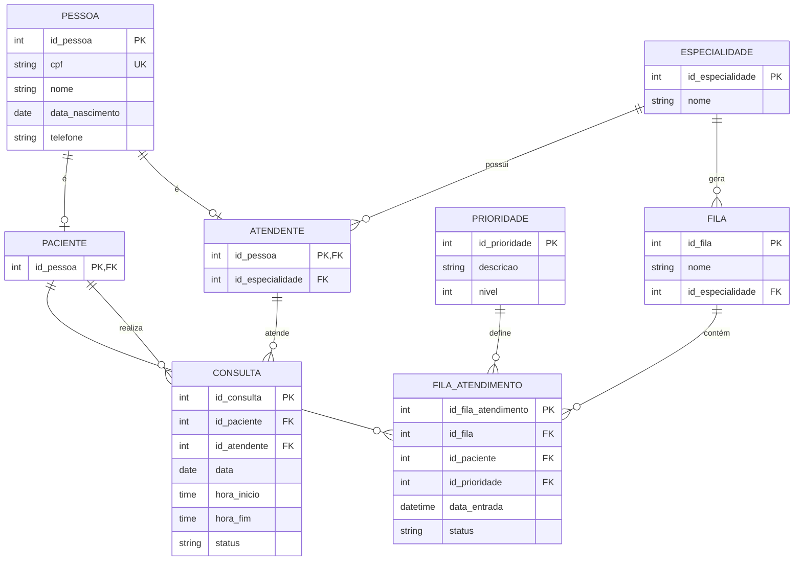

# fila_atendimento
# Sistema de Fila de Atendimento

Projeto de banco de dados desenvolvido em PostgreSQL para gerenciamento de filas, pacientes, atendentes e consultas.

## 📌 Descrição

Este projeto tem como objetivo modelar e implementar um sistema de controle de atendimento, permitindo organizar pacientes em filas com prioridades e registrar consultas realizadas.

O modelo foi baseado em um diagrama entidade-relacionamento (DER), representado abaixo:



---

## 📂 Estrutura do Projeto

```
scripts/
│
├── 001_create_tables.sql     → Criação das tabelas (sem chaves estrangeiras)
├── 002_constraints.sql       → Definição de chaves estrangeiras e restrições
├── 003_inserts.sql           → Inserção de dados de teste
```

---

## 🛠 Tecnologias Utilizadas

* PostgreSQL

---

## ▶️ Como Executar

Execute os scripts na seguinte ordem:

1. `001_create_tables.sql`
2. `002_constraints.sql`
3. `003_inserts.sql`

---

## 📊 Funcionalidades do Banco

* Cadastro de pessoas (pacientes e atendentes)
* Controle de especialidades
* Organização de filas de atendimento
* Definição de prioridades
* Registro de consultas

---


